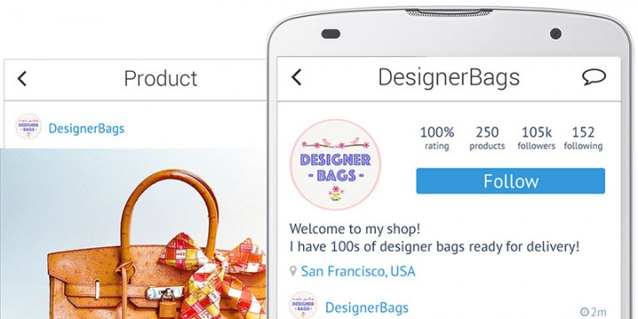
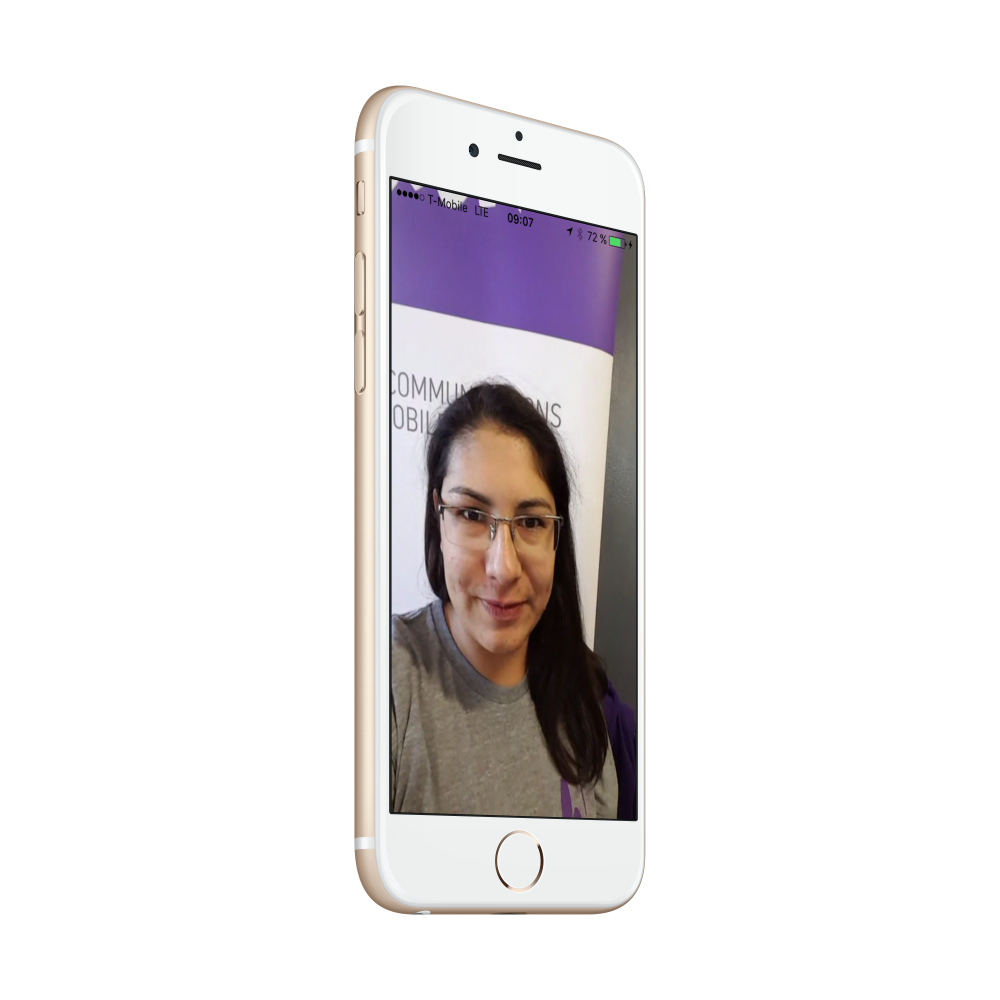
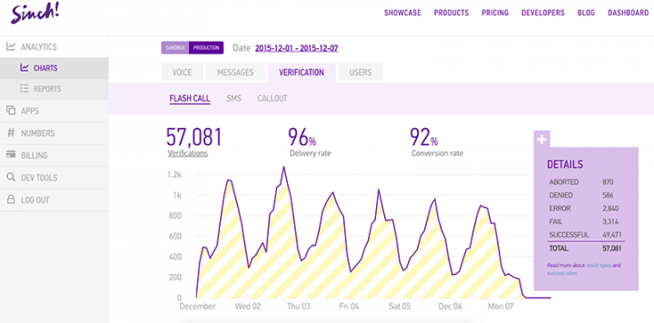

# Demo Tutorial Project

Lorem ipsum dolor sit amet, consectetur adipiscing elit. Duis ac nunc nec orci aliquam dapibus eleifend et turpis. Sed varius justo id nulla fermentum, non elementum tortor consectetur. Praesent laoreet venenatis enim, at pellentesque orci ornare non. Nam pharetra turpis non massa hendrerit, nec varius tellus laoreet. Aliquam varius dictum velit, non molestie erat aliquet quis. Curabitur in aliquam mauris, sit amet ultricies eros. Fusce sagittis mi sit amet tortor cursus bibendum id tempor massa. Curabitur viverra risus at ligula molestie, pretium laoreet neque interdum. Phasellus dictum lacus quis diam fringilla porttitor. Duis bibendum ornare odio non iaculis. Quisque et arcu id nisi varius sollicitudin. Donec tristique quam ac magna aliquam dignissim.

````swift
@IBAction fun calloutVerification(sender: AnyObject) {
    disableUI(true);
    verification = CalloutVerification(
        applicationKey:applicationKey, 
        phoneNumber: phoneNumber.text!);
    verification.initiate { (success:Bool, error:NSError?) -> Void in
        self.disableUI(false);
        self.status.text = (success ? "Verified" : error?.description);
    }
}
````

Cras iaculis nisi nec odio aliquet, eu lobortis ipsum maximus. Aenean nec nunc sollicitudin, pulvinar enim rutrum, feugiat est. Nunc semper nisi leo. Praesent sed iaculis elit, eget egestas ipsum. Pellentesque sed felis ac justo viverra hendrerit eget ac augue. Aliquam pharetra tellus in porta viverra. Donec et semper nisi. Sed orci urna, gravida non nisl et, commodo facilisis odio. Sed lobortis dui quis scelerisque luctus. Phasellus accumsan leo in placerat faucibus. Sed fermentum diam turpis, ut ultrices diam mollis in. Aliquam convallis, magna et pharetra faucibus, eros libero viverra arcu, non egestas ligula mauris eu ante. Nunc vulputate viverra rutrum. Aliquam erat volutpat. Cras hendrerit ante sit amet lectus bibendum blandit.




````swift
fun disableUI(disable: Bool){
    var alpha:CGFloat = 1.0; // if enabled alpha is 1
    if (disable) {
        alpha = 0.5; add alpha to get disabled look
        phoneNumber.resignFirstResponder(); 
        spinner.startAnimating(); 
        self.status.text="";
        // enable the UI after 30 seconds if no success or fail has been received in the
        //verification sdk
        let delayTime = dispatch_time(DISPATCH_TIME_NOW, Int64(30 * Double(NSEC_PER_SEC)))
        dispatch_after(delayTime, dispatch_get_main_queue(), { () -> Void in
            self.disableUI(false);
        });
    }
    else{
        self.phoneNumber.becomeFirstResponder();
        self.spinner.stopAnimating();

    }
    self.phoneNumber.enabled = !disable;
    self.smsButton.enabled = !disable;
    self.calloutButton.enabled = !disable;
    self.calloutButton.alpha = alpha;
    self.smsButton.alpha = alpha;
}
````


Curabitur at velit molestie, lobortis mauris sit amet, faucibus ligula. Phasellus vel mattis ante. Nunc leo nulla, semper vitae tincidunt non, commodo nec quam. Integer viverra lacus ac orci bibendum consectetur. Sed ullamcorper ipsum ac placerat consequat. Ut quis ligula a nisi accumsan dictum in non mauris. Praesent aliquet ligula id lectus sagittis ornare. Vestibulum semper hendrerit lorem. Suspendisse consectetur interdum lacus, id rhoncus lorem finibus nec.

In hac habitasse platea dictumst. Donec eros diam, viverra quis blandit vitae, bibendum in quam. Vivamus mollis bibendum libero vitae condimentum. Sed nec tincidunt nibh. Mauris varius posuere turpis nec commodo. Vestibulum at tortor accumsan orci tempus porta. Morbi dui libero, lacinia non lobortis ac, sollicitudin non sem. Phasellus convallis sem et sem sagittis, eget vulputate ligula fringilla. Nulla facilisi. Donec non efficitur tortor. Pellentesque tempor malesuada diam, id hendrerit massa mollis eget.

````swift
override func viewWillAppear(animated: Bool) {
       phoneNumber.becomeFirstResponder();
       disableUI(false); // make sure UI is enabled,
   }
````




Aenean feugiat dignissim est, sit amet ultrices massa tristique non. Ut eu sodales metus. Sed egestas augue quis feugiat hendrerit. Suspendisse viverra quam pharetra, volutpat turpis vitae, suscipit enim. Curabitur at orci nec quam varius pellentesque quis sed nibh. Aliquam in quam sed felis mattis condimentum ut id sem. Duis vitae mattis massa. Donec aliquam risus eu lacinia mattis. Nullam fringilla laoreet augue in dictum. Curabitur non varius libero, at pulvinar nunc. Sed tristique feugiat est, et consequat elit lobortis sed. Aliquam facilisis mollis lacus, consequat eleifend erat vulputate quis. Proin vitae velit erat. Donec auctor ac libero ut bibendum.


Nullam cursus sem at interdum sagittis. Nam iaculis elementum odio nec porta. Praesent in euismod sapien. Nulla nulla tellus, mattis at elementum sed, bibendum quis sapien. Curabitur et est at massa fermentum vestibulum bibendum eget urna. Proin ut sagittis ante, iaculis molestie risus. Duis quis sem ipsum. Integer pretium enim at nisl gravida, vel interdum nisi blandit. Proin quis elementum justo. Fusce nec pretium tellus, eu suscipit velit. Nullam sodales nibh nec congue venenatis. Donec id metus non metus mattis pellentesque. In sollicitudin elementum scelerisque. Pellentesque et iaculis leo, eu ornare magna. Pellentesque habitant morbi tristique senectus et netus et malesuada fames ac turpis egestas.



Aliquam erat volutpat. Sed ut ornare urna, eget luctus purus. Donec cursus nunc et convallis commodo. Maecenas dictum viverra posuere. Cras dictum ipsum id pretium luctus. Sed accumsan quam at quam laoreet pulvinar. Suspendisse id diam rhoncus mi posuere mollis. Quisque ex tellus, gravida a rhoncus interdum, pellentesque ut enim. Morbi sit amet blandit elit. Aenean vitae pretium nulla. Nam eget ullamcorper nulla. Pellentesque pellentesque rhoncus eleifend. Curabitur congue nec ipsum at eleifend. Sed non nulla nisl. Praesent ultricies neque eu eros facilisis, rutrum rutrum libero semper.

